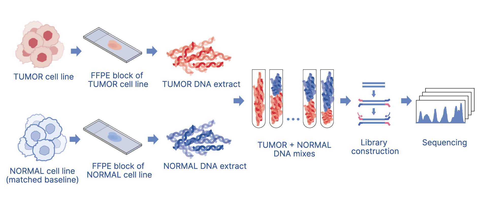
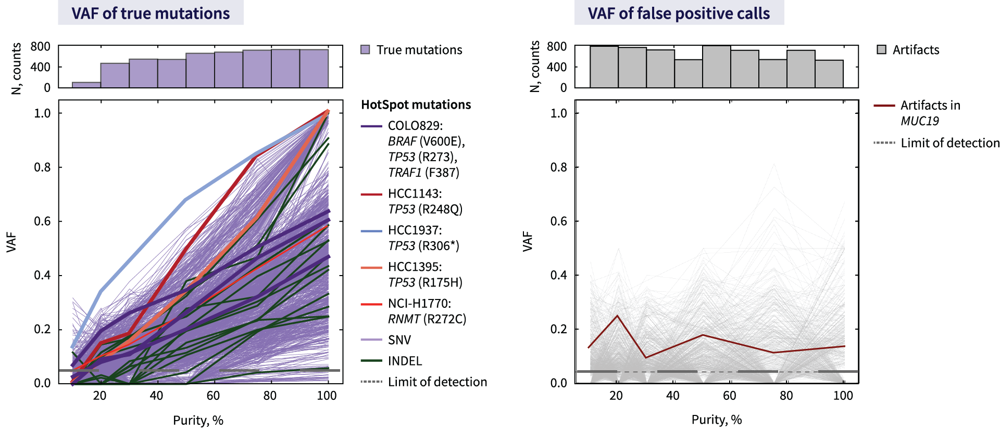

## Somatic_reference_standards
Real-world tumor tissues have heterogeneous cell content, it is essential to use representative samples during assay development and validation. To test both RNA and DNA pipelines, we designed an experiment that allows for controlled decreases in the allelic frequency of variants

## Methods
For each cell line and its corresponding normal B cells, separate FFPE blocks were prepared—one for the tumor cells and one for the matched normal cells. These blocks were stored for 3-4 months, after which DNA extracts were prepared from both the tumor and normal FFPE blocks, as well as from tumor and baseline B cell cultures. The tumor and matched normal DNA extracts were then mixed in various proportions (0:100, 10:90, 20:80, 30:70, 50:50, 25:75, 100:0) before proceeding with library construction procedures.

*Preparing cell lines mixtures of different tumor purities*

## Cell lines description 
| Cell line |         Diagnosis         | Ploidy | TMB | SNV | INDEL | WT genes | Amplifications | Deletions | Neutral |
|-----------|---------------------------|--------|-----|-----|-------|----------|----------------|-----------|---------|
|COLO829    |Melanoma                   |3       |6.0  |489  |11     |18'168    |4'705           |2'614      |9'024    |
|HCC1143    |Ductal Carcinoma, Stage IIA|3       |5.0  |379  |11     |18'445    |8'187           |2'973      |4'599    |
|HCC1397    |Ductal Carcinoma, Stage IIB|3       |5.5  |405  |16     |18'339    |5'495           |4'855      |4'319    |
|HCC1395    |Ductal Carcinima, Stage I  |3       |15.5 |1'018|55     |17'374    |3'341           |5'414      |3'750    |
|NCI-H1770  |NSCLC, Stage 4             |3       |30.5 |1'253|9      |15'918    |2'880           |7'008      |6'785    |

*VAF of true and false positive calls*

## Data availability 
The data generated is available at the SRA repository PRJNA1134786
